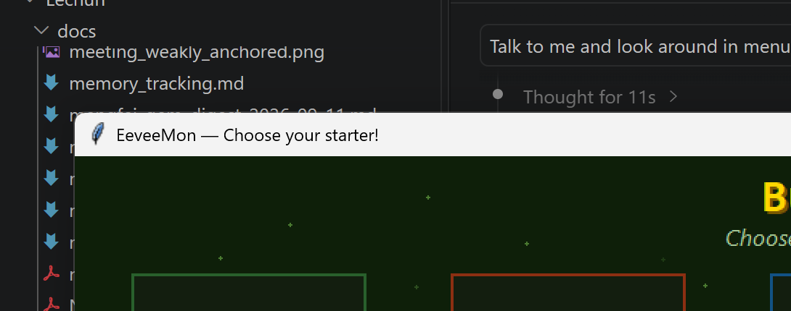

# EeveeMon

A Gen V animated Pokémon desktop pet for Windows, built as a feature-rich
mod of [BuddyMon](https://github.com/hasturah/buddymon). EeveeMon adds the
**Eevee family** with a real 8-way branching stone evolution system, the
**Torchic → Combusken → Blaziken** line, and an optional AI chat companion
supporting multiple mainstream LLM providers.

The pet lives on your taskbar, walks around with gravity physics, and is
entirely controlled from its right-click menu.



---

## Table of contents

- [Features](#features)
- [Quick start](#quick-start)
- [Usage](#usage)
- [AI chat companion](#ai-chat-companion)
- [Building from source](#building-from-source)
- [Project architecture](#project-architecture)
- [Related projects](#related-projects)
- [Credits & license](#credits--license)

---

## Features

**Roster** — eight starter cards (4×2 grid) on the selection screen:

| Line | Type | Evolution |
|---|---|---|
| Bulbasaur | Grass | Bulbasaur → Ivysaur → Venusaur |
| Charmander | Fire | Charmander → Charmeleon → Charizard |
| Squirtle | Water | Squirtle → Wartortle → Blastoise |
| **Eevee** | **Multi** | Eevee → any of the 8 Eeveelutions (branching) |
| **Torchic** | Fighting | Torchic → Combusken → Blaziken |
| **Meowth** | Normal | none (single form) |
| **Latias** | Dragon | none (single form) |
| **Pikachu** | Electric | none (single form) |

**Branching evolution** — Eevee's right-click *Evolve* menu offers all eight
Eeveelutions, each with its canonical method displayed and enforced:

| Evolution | Requirement |
|---|---|
| Vaporeon | Water Stone (水之石) |
| Jolteon | Thunder Stone (雷之石) |
| Flareon | Fire Stone (火之石) |
| Leafeon | Leaf Stone (叶之石) |
| Glaceon | Ice Stone (冰之石) |
| Espeon | daytime friendship |
| Umbreon | nighttime friendship |
| Sylveon | fairy bond |

**Real stone economy** — the inventory starts with one stone of each kind;
evolving consumes the stone; the menu shows live counts and disables
`×0` entries. *Gift 进化石* grants a random stone on a 10-minute cooldown.

**Quality of life**

- 1-in-100 shiny chance on spawn, evolution, and reroll
- 4 moves per line with particle effects
- Size presets from 50% to 300%
- Drag to reposition; gravity and wall-bounce physics
- Devolve (Eeveelutions jump straight back to Eevee)
- Magenta-background keyout on the selection screen and an anti-fringe
  edge snap on the taskbar sprite path
- Tk pixmap-budget fix: only starter sprites preload; the rest load lazily

## Quick start

### Option A — prebuilt executable (no dependencies)

Download `EeveeMon.exe` from
[Releases](../../releases), double-click, and play. All 48 sprites are
bundled inside the executable.

### Option B — run from source

Windows, Python 3.8+:

```bat
python fetch_sprites.py     REM downloads the sprites into sprites/
python eeveemon.py
```

### Option C — macOS (source run)

The pet is cross-platform: on macOS it uses the window's
`-transparent` attribute with alpha-keyed frames instead of
the Windows colour key, and walks above the Dock. No binary
is provided for macOS (built on Windows) — run from source:

```sh
chmod +x run_mac.sh && ./run_mac.sh
```

or manually: `python3 -m pip install Pillow`,
`python3 fetch_sprites.py`, `python3 eeveemon.py`.

## Usage

Everything is reachable from the pet's right-click menu:

| Action | Menu item |
|---|---|
| Evolve / choose an Eeveelution | Evolve |
| Back to the previous form | Devolve |
| Random stone on a 10-min cooldown | Gift 进化石 |
| Particle-effect moves | Use Move |
| Switch starter line | Change Starter |
| 50% – 300% size | Change Size |
| Re-roll the 1/100 shiny | Reroll Shiny |
| Chat with the pet | Talk to Me |
| Have the pet "look" at your screen | Look Around |
| Fun bubble animation | Throw Up |
| Exit | Quit |

## AI chat companion

The speech-bubble companion is optional and provider-agnostic. Put two
plain-text files next to the executable (or the script):

`apikey.txt` — one line, your API key:

```
sk-xxxxxxxxxxxxxxxx
```

`provider.txt` — line 1: provider, line 2 (optional): model name:

```
deepseek                    REM default; model: deepseek-chat
openai                      REM model: gpt-4o-mini
anthropic                   REM model: claude-3-5-haiku-latest
```

No files = pure pet mode. The key is read from the local file only, is sent
exclusively to the chosen provider's official endpoint
(`api.deepseek.com` / `api.openai.com` / `api.anthropic.com`), and is never
printed or persisted anywhere else.

## Building from source

```bat
build_exe.bat
```

(Windows only — PyInstaller one-file builds are platform-specific.)

This fetches the sprites if missing and produces a one-file
`dist\EeveeMon.exe` via PyInstaller.

## Project architecture

- `eeveemon.py` — the whole application (~1.4k lines), structured as:
  - `STARTER_LINES` — declarative roster: each line carries its
    evolutions (id, name, method, requirement) and moves
  - `Buddy` — the taskbar sprite, physics, right-click menu
  - `AgentMind` — the provider-agnostic AI chat layer (raw HTTP, no SDK)
  - `StarterSelect` — the animated selection screen
  - `load_frames` — GIF loading with a dual transparency strategy:
    magenta bake for the window colour key (taskbar) and alpha keyout
    composited over the card background (selection screen)
- `fetch_sprites.py` — sprite acquisition (Gen V animated GIFs from
  PokeAPI; not stored in this repository)
- `EeveeMon.bat` — one-click restart for the dev machine (Windows)
- `run_mac.sh` — one-command source run on macOS
- `build_exe.bat` — PyInstaller packaging (Windows)

## Related projects

EeveeMon is one member of a small family of desktop-pet experiments.
They intentionally stay **isolated** (separate folders, separate state)
rather than sharing code; ideas are ported between them as features.

| | EeveeMon | BuddyMon | PokeDesk | IdleMon |
|---|---|---|---|---|
| Stack | Python + Tkinter | Python + Tkinter | C# / .NET 8 WPF | Python + PySide6 |
| Scope | Taskbar pet | Taskbar pet | Full Tamagotchi | Shiny-hunting game |
| Roster | 8 lines incl. the 8-way Eevee branch | 3 Kanto lines | All 151 Gen-1 | Encounters, Gen 1–5 |
| Evolution | Branching + stones (real economy) | Linear 3-stage | Needs/level-based, full life cycle | n/a |
| Extras | Multi-provider AI chat | Optional AI chat | Needs, economy, minigames, weather layer | Encounter counters, collection |
| Status | This project | Upstream (modded here) | Third-party; forked as reference | Third-party; forked as reference |

[BuddyMon](https://github.com/hasturah/buddymon) is the upstream this
project mods. [PokeDesk](https://github.com/Glatzenheikoo/PokeDesk) and
[IdleMon](https://github.com/zainibeats/idlemon) are separate third-party
projects — if you want to archive them, please **fork the originals**
rather than re-uploading their source.

## Credits & license

- Based on [BuddyMon](https://github.com/hasturah/buddymon) (MIT)
- Sprites: [PokeAPI/sprites](https://github.com/PokeAPI/sprites) — Gen V
  Black/White animated sprites, fetched at build time and not stored here
- Pokémon © Nintendo / Game Freak / The Pokémon Company. This is a
  non-commercial fan project, not affiliated with or endorsed by Nintendo.

MIT license — see [LICENSE](LICENSE).
